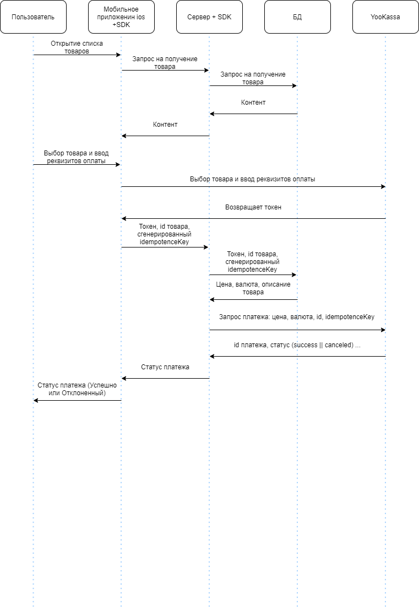

<!DOCTYPE html>
<html>

<head>
  <meta charset="utf-8">
  <meta name="viewport" content="width=device-width, initial-scale=1.0">
  <title>YooKassa</title>
  <link rel="stylesheet" href="https://stackedit.io/style.css" />
</head>

<body class="stackedit">
  
<ul>
<li><a href="%D1%81%D1%85%D0%B5%D0%BC%D0%B0-%D0%BF%D0%BB%D0%B0%D1%82%D0%B5%D0%B6%D0%B0">Схема платежа</a></li>
<li><a href="%D1%82%D0%B5%D1%80%D0%BC%D0%B8%D0%BD%D1%8B">Термины</a></li>
<li><a href="#%D1%83%D1%81%D1%82%D0%B0%D0%BD%D0%BE%D0%B2%D0%BA%D0%B0">Установка</a></li>
<li><a href="#%D0%B8%D0%BD%D0%B8%D1%86%D0%B8%D0%B0%D0%BB%D0%B8%D0%B7%D0%B0%D1%86%D0%B8%D1%8F">Инициализация</a></li>
<li><a href="#%D1%81%D0%B5%D1%80%D0%B2%D0%B5%D1%80%D0%BD%D0%B0%D1%8F-%D1%87%D0%B0%D1%81%D1%82%D1%8C-%D0%BD%D0%B0%D0%BF%D0%B8%D1%81%D0%B0%D0%BD%D0%B0-%D0%BD%D0%B0-%D1%8F%D0%B7%D1%8B%D0%BA%D0%B5-php">Серверная часть написана на языке php</a></li>
</ul>
<h3 id="полезные-ссылки">Полезные ссылки</h3>
<ul>
<li><a href="https://yookassa.ru/developers/payments/sdk-tokens?lang=php">Документация YooKassa</a></li>
<li><a href="https://yookassa.ru/developers/api?lang=php#create_payment">Справочник YooKassa, примеры кода сервера</a></li>
</ul>
<h1 id="схема-платежа">Схема платежа</h1>

<h1 id="термины">Термины</h1>
<ul>
<li><strong>token</strong> - Получаемый ключ с YooKassa как альтернатива платежным данным.</li>
<li><strong>IdempotenceKey</strong> - Уникальный ключ который генерируется на стороне клиента при старте приложения и обновляется при получении статуса произведенного платежа. Ключ исключает создание дубликатов платежей при возникновении ошибок различного рода.</li>
</ul>
<h1 id="установка">Установка</h1>

В консоли 
<code>pod install</code> 
В файле ‘Podfile’

<pre><code>pod 'YooKassaPayments',
    :git =&gt; 'https://github.com/yoomoney/yookassa-payments-swift.git',
    :tag =&gt; '6.0.0'
</code></pre>

В консоли 
<code>pod update</code>

<h1 id="инициализация">Инициализация</h1>
<h3 id="импорт-библиотеки-yookassa">Импорт библиотеки YooKassa</h3>
<pre class=" language-swift"><code class="prism  language-swift">import YooKassaPayments
</code></pre>
<h3 id="объявление-свойств">Объявление свойств</h3>
<pre class=" language-swift"><code class="prism  language-swift">final  let  clientApplicationKey = "test_ODExMzkxT6xTXvpxnOTT4nVxxSK5vJTUMjL47pzIFYY"  // Ключ приложения
final  let  moneyAuthClientId = "idUser1"  // Уникальный идентификатор пользователя, привязан к аккаунту
// Отображаемые данные, но не действительные
let shopName = "AliBaba"  // Название магазина
let amount = Amount(value: 999.99, currency: .rub) // Сумма и валюта покупки
let  purchaseDescription = "Пакет гороха"  // Описание покупки
var  inputData: TokenizationFlow?
</code></pre>
<h3 id="инициализация-во-viewdidload">Инициализация во viewDidLoad()</h3>
<pre class=" language-swift"><code class="prism  language-swift">override  func  viewDidLoad() {
	super.viewDidLoad()
	let tokenizationModuleInputData = TokenizationModuleInputData(
		clientApplicationKey: clientApplicationKey,
		shopName: shopName,
		purchaseDescription: purchaseDescription,
		amount: amount,
		gatewayId: nil,
		tokenizationSettings: TokenizationSettings(paymentMethodTypes: .all, showYooKassaLogo: true),
		testModeSettings: nil,
		cardScanning: nil,
		applePayMerchantIdentifier: nil,
		returnUrl: nil,
		isLoggingEnabled: false,
		userPhoneNumber: nil,
		customizationSettings: CustomizationSettings(mainScheme: .blue), // Цвет некоторых элементов модального окна
		savePaymentMethod: .off, // Возможность создания автоплатежа
		moneyAuthClientId: moneyAuthClientId,
		applicationScheme: nil
	)
	self.inputData = .tokenization(tokenizationModuleInputData)
}
</code></pre>
<h3 id="активация-начала-платежа">Активация начала платежа</h3>
<pre class=" language-swift"><code class="prism  language-swift">@IBAction func buy(_ sender: Any) {
	guard let inputData = inputData else {return}
	let viewController = TokenizationAssembly.makeModule(inputData: inputData, moduleOutput: self)
	present(viewController, animated: true, completion: nil) // Отображается модальное окно выбора способа оплаты
}
</code></pre>
<h3 id="расширения-обработки-событий">Расширения обработки событий</h3>
<pre class=" language-swift"><code class="prism  language-swift">extension InitialViewController: TokenizationModuleOutput {
	// Будет вызван, когда процесс токенизации успешно пройдет.
	func tokenizationModule(_ module: TokenizationModuleInput, didTokenize token: Tokens, paymentMethodType: PaymentMethodType) {
		// Отправьте токен в вашу систему
		let model = Payment()
		model.sendPayment(token: token.paymentToken, idOrder: 1) { (response,error) -&gt; Void in
			// Закрывает модальное окно токенизации
			DispatchQueue.main.async { [weak self] in
				guard let self = self else { return }
				self.dismiss(animated: true)
			}
			if let error = error {
				print(error)
				return
			}
			guard let status = response?["status"] as? String else {return}
			switch (status) {
				case "succeeded":
					// Вызов сообщения успешного платежа
				case "canceled":
					// Вызов сообщения отклоненного платежа
				default:
					print("defaultCase")
			}
		}
	}
	
	// Будет вызван, когда пользователь не завершил оплату и не завершил работу. Если пользователь выйдет не дождавшись окончания операции
	func didFinish(on module: TokenizationModuleInput, with error: YooKassaPaymentsError?) {
		DispatchQueue.main.async { [weak self] in
			guard let self = self else { return }
			self.dismiss(animated: true)
		}
	}
	// Будет вызван, когда 3-D безопасный процесс успешно пройдет.
	func didSuccessfullyPassedCardSec(on module: TokenizationModuleInput) {}
	// Будет вызван, когда процесс подтверждения успешно пройдет. Оплата через веб-клиент, статус pending
	func didSuccessfullyConfirmation(paymentMethodType: PaymentMethodType) {}
}
</code></pre>
<h3 id="модель">Модель</h3>
<pre class=" language-swift"><code class="prism  language-swift">import Foundation
import Alamofire
import AlamofireObjectMapper

class  Payment {
	func sendPayment(token: String, idOrder: Int, completion: @escaping (_ response: NSDictionary?, _ error:  Error?) -&gt; Void) {
		guard let url = URL(string: "http://192.168.1.107:8000/") else {return}
		let param: Parameters = [
			"idempotenceKey": idempotenceKeyGenerator(length: 36),
			"paymentToken": token,
			"idOrder": idOrder
		]
		Alamofire.request(url, method: .post, parameters: param, encoding: URLEncoding.default, headers: nil)
			.responseJSON { response in
			switch response.result {
				case .success(let response):
				let response = response as! NSDictionary
				completion(response, nil)
				case .failure(let error):
				completion(nil, error)
			}
		}
	}
	func idempotenceKeyGenerator(length: Int) -&gt; String {
		let letters = "abcdefghijklmnopqrstuvwxyzABCDEFGHIJKLMNOPQRSTUVWXYZ0123456789"
		return String((0..&lt;length).map{ _ in letters.randomElement()! })
	}
}
</code></pre>
<h1 id="серверная-часть-написана-на-языке-php">Серверная часть написана на языке php</h1>
<h3 id="установка-библиотеки-yookassa-через-composer">Установка библиотеки YooKassa через Composer</h3>

composer.json

<pre class=" language-json"><code class="prism  language-json">{
	"require": {
		"php": "&gt;=5.3.2",
		"yoomoney/yookassa-sdk-php": "^2.1"
	}
}
</code></pre>
<h3 id="код-серверной-части">Код серверной части</h3>
<pre class=" language-php"><code class="prism  language-php">&lt;?php
	require  __DIR__  .  '/vendor/autoload.php';

	use YooKassa\Client;
	$client = new  Client();
	$client-&gt;setAuth('811391', 'test_N-jp4quY-VGQg27blFQT5VI1_9YDMr5HL0udkeidwVM');

	// Данные товара из БД, на основании idOrder
	// $_POST["idOrder"];
	$amountValue = '2.00';
	$amountCurrency = 'RUB';
	$orderDescription = 'Зеленый горошек';

	$response = $client-&gt;createPayment(
		array(
			'payment_token' =&gt; $_POST["paymentToken"],
			'amount' =&gt; array(
				'value' =&gt; $amountValue,
				'currency' =&gt; $amountCurrency,
			),
			'capture' =&gt; true, // false - двухстадийный платёж
			'description' =&gt; $orderDescription,
			'metadata' =&gt; array(
			'order_id' =&gt; $_POST["idOrder"],
			)
		),
		uniqid($_POST["idempotenceKey"], true) // Уникальный ключ который запишется в БД
	);
	$data = array(
	"status" =&gt; $response-&gt;status
	);
	echo json_encode( $data );
?&gt;
</code></pre>

</body>

</html>
